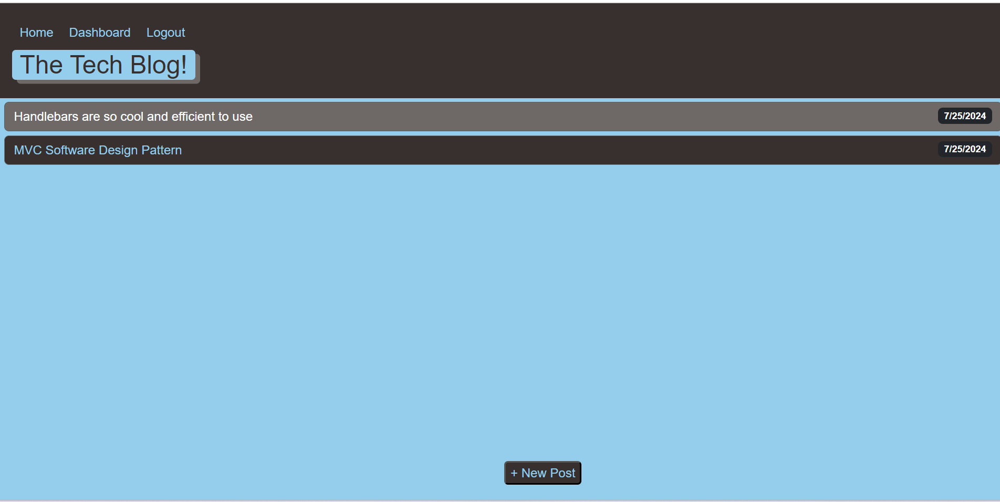

# TECH-BLOG-PRESS

## Description

Tech Blog Press application provides a platform to posts blogs about latest tech advancements in the industry. As a blogger, you can take advantage of this site to stay upto date with the latest news about tech in the market. The site also lets you create a user profile and provides ability to create a new blog, update an existing blog and provide comments on blog created by other users.

Application incorporates MVC (Model View Controller) design pattern and uses Sequelize for managing `Models`, Handlebars for rendering `Views` and express routes for `Controller`. The user sessions are managed using express session and stores session related data in PostgreSQL database using Sequelize session.

## Screenshots

## Link To Deployed Site

https://tech-blog-press.onrender.com/